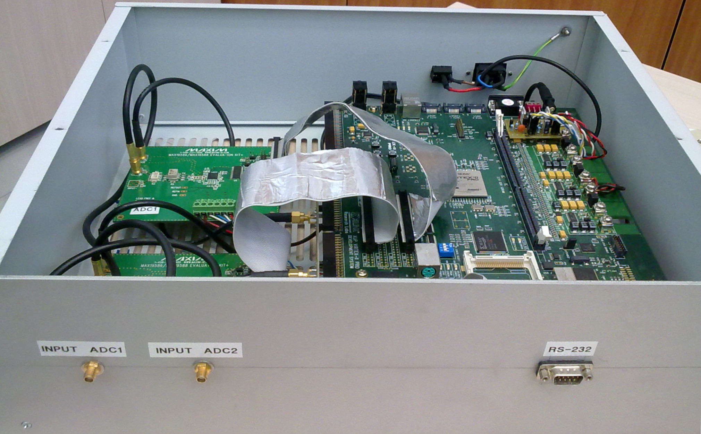

This repository contains the Verilog HDL and Python code of the backend of the microwave holography system (shown in the following image) running on the Sardinia Radio Telescope (SRT)1.
The backend is implemented on a Digilent Virtex-II Pro FPGA Development System2. The A/D conversion is perfomed by means of two Maxim Evaluation Kit3 mounting the Maxim 19588 ADC4.

#### References:
1. [G. Serra; P. Bolli; G. Busonera; T. Pisanu; S. Poppi; F. Gaudiomonte; G. Zacchiroli; J. Roda; M. Morsiani; J. A. López-Pérez - *The microwave holography system for the Sardinia Radio Telescope* - Proceedings of SPIE: Ground-based and Airborne Telescopes IV, vol.8444, 2012](
https://www.spiedigitallibrary.org/conference-proceedings-of-spie/8444/84445W/The-microwave-holography-system-for-the-Sardinia-Radio-Telescope/10.1117/12.926160.short)
2. [Digilent Virtex-II Pro FPGA Development System,  Accessed: march 25, 2020](https://store.digilentinc.com/virtex-ii-pro-fpga-development-system-limited-time/)
3. [MAX19588 EVKIT, Accessed: march 25, 2020](https://www.maximintegrated.com/en/products/analog/data-converters/analog-to-digital-converters/MAX19588EVKIT.html)
4. [MAX19588 ADC, Accessed: march 25, 2020](https://www.maximintegrated.com/en/products/analog/data-converters/analog-to-digital-converters/MAX19588.html)
